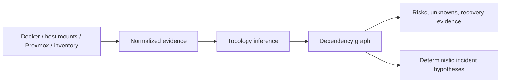

# agentic-homelab

[](https://github.com/aashirjaved/agentic-homelab/actions/workflows/validate.yml)
[](LICENSE)
[](docs/safety-model.md)

## Your homelab, explained.

**Understand what is running, how it depends on everything else, what is at
risk, and what to do next.** `agentic-homelab` is a read-only intelligence layer
for Proxmox, Docker, storage, networking, and services. It correlates the parts
of a messy homelab without changing them.

Ask the questions that normally require checking five different dashboards:

- Why is Jellyfin unavailable?
- What breaks if I reboot this VM?
- Which services do not have a proven recovery path?
- What changed last night?
- Where are my single points of failure?

> It shows what the evidence connects—and what it still cannot prove. It changes nothing.

The project starts read-only. Its MCP servers, safety policies, and approval
gates are the machinery behind the product—not the reason you should use it.

> Practical over hype. Read-only first. Human-approved writes. Mechanical verification.

```console
$ homelab investigate jellyfin
# media-lab: explained

Found 3 nodes, 5 services, 2 storage systems, 1 stack,
2 networks, and 16 relationships.

## Why is jellyfin broken?
Top hypothesis (high): media-nfs — dependency health check failed.

Path inspected:
jellyfin → media-stack → docker-host → media-nfs → nas01 → pve-01

No changes have been made.
```

Collectors gather read-only evidence, deterministic inference connects the
topology, and explicit rules produce findings and ranked hypotheses. Agent
reasoning can consume that evidence later; it is not required to trust the
doctor's output. **Deterministic evidence first. Agent reasoning second.**



## Quick Start: See Your Homelab in Minutes

Install from a clone with `pipx`, then run the doctor:

```bash
git clone https://github.com/aashirjaved/agentic-homelab.git
cd agentic-homelab
pipx install .
homelab doctor
```

Investigate a specific service with the same command:

```bash
homelab investigate jellyfin
```

The investigator traverses Jellyfin's dependencies, correlates current findings
with the latest timeline changes, ranks root-cause hypotheses, shows downstream
impact, and gives read-only verification steps. It reports insufficient evidence
instead of inventing a cause.

The same report answers “what recovery evidence is declared?” per service. It
scores supplied metadata for configuration, keys and secrets, restore runbooks,
restore-test dates, stateful storage, and backup failure-domain separation. It
does not inspect backup contents or perform a restore. A fresh backup is a
signal; a successful restore test is stronger evidence.

Ask what is safe to update without enabling auto-update:

```bash
homelab updates
```

The result gates candidates on current health and supplied metadata for recovery,
release research, rollback, verification, recent stability, and blast radius.
The doctor does not fetch release notes or vulnerability feeds yet. “Ready for
approval” deliberately does not mean “executed.”

The command safely inspects the local host, Docker, storage capacity, DNS and
Tailscale state, plus Proxmox when a scoped API token is configured. If a source
is unavailable, the report says so explicitly. Point `--inventory` at your YAML
or JSON file to enrich discovery with NAS, backup, recovery, update, and
dependency knowledge. To create a redacted report for Reddit, Discord, GitHub,
or a forum:

```bash
homelab doctor \
  --inventory path/to/homelab.inventory.yaml \
  --share diagnostics/homelab-report.md
```

Or create a complete redacted support bundle:

```bash
homelab share diagnostics/jellyfin-incident \
  --inventory path/to/homelab.inventory.yaml \
  --investigate jellyfin
```

Vendor-neutral HTTP health checks can be declared for services and NAS/storage
systems. The doctor records only status and latency—never endpoint URLs or
response bodies—and correlates failures with dependencies and recent changes.

The report explains known relationships, ranks obvious risks, calls out what it
cannot establish, remembers a local baseline for “what changed?”, and states
that no infrastructure changes were made. Private IPv4 addresses
and URL hosts are redacted from the share copy; always review it before posting.

See [the doctor guide](docs/homelab-doctor.md) for the inventory relationship
fields and output contract.

## What This Is

`agentic-homelab` is an open-source homelab intelligence layer. It builds a
useful model from infrastructure inventory and read-only observations, then
turns that model into diagnosis, risk analysis, and recovery guidance.

It gives agents structured context, read-only tools, explicit approval gates, and
verification patterns for common homelab setups:

- Proxmox and VM-heavy labs;
- Docker and Compose stacks;
- media servers and NAS storage;
- monitoring and incident triage;
- multi-node local networks;
- local agents such as OpenClaw and Hermes;
- coding-agent clients such as Claude, Codex, Cursor, and Grok.

## What This Is Not

- Not a turnkey autopilot for your infrastructure.
- Not a replacement for backups, restore testing, or human approval.
- Not a collection of root shell prompts.
- Not a claim that every write operation is implemented or safe.

The reference MCP servers are read-only by default. Risky operations are
represented in manifests and guardrails so agents can plan and ask for approval,
but the reference implementations intentionally avoid destructive writes.

## Why This Exists

Homelabs are personal infrastructure: hypervisors, NAS boxes, media servers,
Docker hosts, monitoring stacks, local agents, VPNs, and private data. Agents can
help maintain them, but only when they have clear context, scoped tools, and
strong boundaries.

The goal is simple: make the safe path the easy path.

## Agent Integration

After trying the doctor, validate the repo and bootstrap a context for an MCP
client or local agent:

```bash
make validate                  # creates .venv and installs dependencies
source .venv/bin/activate      # required for the python3 commands below
python3 scripts/bootstrap_homelab_repo.py /path/to/your/homelab-agent-context
```

Install the skills bundle with the same GitHub shorthand convention used by
modern skills repos:

```bash
npx skills add aashirjaved/agentic-homelab --yes
```

Each source skill is self-contained with `SKILL.md`, `LICENSE.txt`, and
`agents/openai.yaml` metadata for agent ecosystems that support it.

Then edit:

- `/path/to/your/homelab-agent-context/homelab.inventory.yaml`
- `/path/to/your/homelab-agent-context/AGENTS.md`
- `/path/to/your/homelab-agent-context/guardrails/policies/default-policy.yaml`

Pick a safe first workflow:

```bash
python3 scripts/choose_workflow.py --inventory /path/to/your/homelab-agent-context/homelab.inventory.yaml
```

Classify actions before running them:

```bash
python3 scripts/guardrail_check.py list_nodes
python3 scripts/guardrail_check.py network-exposure
python3 scripts/guardrail_check.py destructive
```

Exit codes are part of the contract: `0` means allow read-only, `2` means stop
for approval — so the last two commands exiting `2` is the guardrail working,
not a crash.

## What Is Included

| Area | Purpose |
| --- | --- |
| `packages/mcp-servers/` | Read-only reference MCP servers and manifests for Proxmox, Docker, storage/NAS, networking, monitoring, and VM management. |
| `skills/` | Agent skills for setup, infrastructure maintenance, agent self-management, and safety. |
| `guardrails/` | Default policy, model routing example, and action risk matrix. |
| `examples/` | Machine-readable workflows for Proxmox, Docker, NAS/media, monitoring, local agents, diagnostics, and backup restore drills. |
| `templates/` | Inventory starters, agent instructions, diagnostics format, and local-agent service templates. |
| `schemas/` | JSON Schemas for inventory, MCP manifests, guardrail policies, workflows, and action risk matrix. |
| `scripts/` | Validation, MCP smoke tests, diagnostics bundle generation, workflow chooser, guardrail checker, bootstrapper, doctor, and release audit. |
| `docs/` | Quickstarts, safety model, threat model, architecture patterns, credential patterns, and release readiness. |

## Safety Model

Agents should follow this loop:

1. **Observe** read-only state.
2. **Explain** findings and uncertainty.
3. **Plan** exact changes, rollback, and verifier.
4. **Approve** one risky action at a time.
5. **Execute** only the approved action.
6. **Verify** using external evidence.
7. **Record** the result.

Default-deny categories include writes, destructive actions, credential access,
network exposure, storage changes, public ingress, service restarts, and agent
self-mutation.

Start with:

- [docs/safety-model.md](docs/safety-model.md)
- [docs/action-risk-matrix.md](docs/action-risk-matrix.md)
- [docs/threat-model.md](docs/threat-model.md)
- [templates/agent-instructions/AGENTS.md](templates/agent-instructions/AGENTS.md)

## Supported Domains

| Domain | Status | Primary Assets |
| --- | --- | --- |
| Proxmox | Read-only reference server | `packages/mcp-servers/proxmox`, `docs/proxmox-readonly-token.md`, `examples/proxmox-vm-maintenance` |
| Docker/Compose | Read-only reference server | `packages/mcp-servers/docker`, `examples/docker-stack-maintenance` |
| Storage/NAS | Read-only reference server | `packages/mcp-servers/storage-nas`, `examples/media-server-nas`, `examples/backup-restore-drill` |
| Networking | Read-only diagnostics and plan tools | `packages/mcp-servers/networking`, `guardrails/action-risk-matrix.yaml` |
| Monitoring | Read-only metrics/logs/alerts and incident summaries | `packages/mcp-servers/monitoring`, `examples/multi-node-monitoring` |
| VM management | Read-only inventory and snapshot planning | `packages/mcp-servers/vm-management` |
| Local agents | Templates and runtime workflows | `templates/agent-runtime`, `examples/local-agent-runtime` |

## Supported Clients

| Client | Best Use | Quickstart |
| --- | --- | --- |
| OpenClaw | Local homelab agent runtime | [docs/quickstart-openclaw.md](docs/quickstart-openclaw.md) |
| Hermes | Local agent runtime and maintenance assistant | [docs/quickstart-hermes.md](docs/quickstart-hermes.md) |
| Claude | MCP desktop/client operator | [docs/quickstart-claude.md](docs/quickstart-claude.md) |
| Codex | Repo operator for scripts, docs, validation, workflows | [docs/quickstart-codex.md](docs/quickstart-codex.md) |
| Cursor | Coding-agent editing and validation | [docs/quickstart-cursor.md](docs/quickstart-cursor.md) |
| Grok | Planning/reference assistant | [docs/quickstart-grok.md](docs/quickstart-grok.md) |

See [docs/client-compatibility.md](docs/client-compatibility.md).

## Common Commands

```bash
make validate                 # schema checks, repo checks, MCP smoke tests
make guardrail-smoke          # action classification examples
make workflow-chooser-smoke   # workflow recommendations from sample inventory
make release-audit            # pass/fail/manual release evidence
make doctor                   # discover and explain the local homelab
make readiness                # repository/client prerequisite checks
```

Generate an MCP client config with absolute paths:

```bash
python3 scripts/generate_mcp_config.py \
  --inventory templates/inventory/homelab.inventory.example.json \
  --output generated/mcp-config.json
```

Create a redacted intelligence and diagnostics bundle:

```bash
homelab share diagnostics/example \
  --inventory templates/inventory/homelab.inventory.example.yaml
```

## Documentation Map

Start here:

- [docs/quickstart.md](docs/quickstart.md)
- [docs/client-compatibility.md](docs/client-compatibility.md)
- [docs/workflow-chooser.md](docs/workflow-chooser.md)
- [docs/implemented-capabilities.md](docs/implemented-capabilities.md)

Safety and operations:

- [docs/safety-model.md](docs/safety-model.md)
- [docs/action-risk-matrix.md](docs/action-risk-matrix.md)
- [docs/threat-model.md](docs/threat-model.md)
- [docs/credential-patterns.md](docs/credential-patterns.md)
- [docs/maintenance-loop.md](docs/maintenance-loop.md)
- [docs/backup-restore-drills.md](docs/backup-restore-drills.md)

Project and release:

- [docs/repo-map.md](docs/repo-map.md)
- [docs/release-readiness.md](docs/release-readiness.md)
- [docs/roadmap.md](docs/roadmap.md)
- [CHANGELOG.md](CHANGELOG.md)

## Current Status

The product-facing doctor discovers local Docker, storage, and network state;
optionally reads Proxmox and declared service/NAS endpoints; builds a dependency
graph and change timeline; ranks incident hypotheses; assesses recovery and
updates; and creates redacted support bundles. Reference MCP servers remain
available as read-only integration surfaces.

Live-environment behavior still depends on the permissions and APIs available
in each user's lab. The integrations are smoke-tested against representative
fixtures; broader
independent testing across Proxmox, Docker, NAS, macOS, and Linux remains useful.
Repository identity and the skills installer shorthand are declared in
`catalog/index.yaml` under `repository`.

Some checks still require real environments and are intentionally marked manual
by `make release-audit`, including fresh-clone validation by another user, a
real scoped Proxmox token test, Docker host testing, and diagnostics on macOS and
Linux.

See [docs/implemented-capabilities.md](docs/implemented-capabilities.md) for the
exact implementation boundary.

## Where This Is Going

The north star is the best open-source intelligence layer for understanding a
messy homelab: broader discovery, stronger dependency inference, richer change
sources, and increasingly useful diagnosis and recovery evidence. Approval-gated
writes come only after users trust those explanations; autonomy is not the
product wedge. See [docs/roadmap.md](docs/roadmap.md).

## Contributing

Contributions are welcome when they preserve the safety model.

New integrations should include:

- a package or skill README;
- a read-only mode;
- permission documentation;
- examples;
- safety notes;
- catalog metadata;
- validation coverage where possible.

See [CONTRIBUTING.md](CONTRIBUTING.md), [CODE_OF_CONDUCT.md](CODE_OF_CONDUCT.md),
and [SECURITY.md](SECURITY.md).

## License

MIT. See [LICENSE](LICENSE).

---

⭐ If this saves your homelab from an over-eager agent, a star helps others find it.
